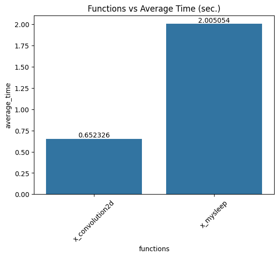
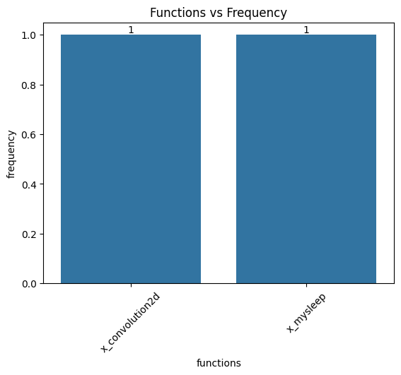

# pysimpler


This package simplifies the fundamental software engineering practices such as exception handling, logging etc. 


## Installation

```
pip install pysimpler
```

## Activate/Deactivate

You have to set PYSIMPLER environment variable as 1 to activate pysimpler. If you want to deactivate it, you should set as 0.

```
#activate
export PYSIMPLER=1

#deactivate
export PYSIMPLER=0
```
##  Report

You can add following command at end of your code for reporting.

```python
pysimpler.reporter.report()
```


  


## Features

### 1. Time Logger


This feature aims to log duration of the execution time of method. We use **timer** keyword for using this feature. It help you analysing your bottlenecks in function level.


**Example:**

```python
import pysimpler

@pysimpler.timer.actual()
def counter(count):
    x = 1
    for i in range(count):
        y = x*i

if __name__ == '__main__':

    print("Process 1")
    result = counter(10)
    print("Process 3")

pysimpler.reporter.report()

# output
# ------------------------------
# Process 1
# 2023-12-25T11:55:38.474173+0300 | INFO | File: app.py | Function : counter | Duration : 0.0005151670000032027 sec
# Process 3
```


### 2. Cache Cleaner (In Progress)


```python
import pysimpler
import gc

@pysimpler.cache.clear()
def memory(count):
    mem = []
    for i in range(count):
        mem.append("data")

if __name__ == '__main__':
    # print(gc.get_count()) lines are only for printing of the memory state. 
    # You can remove it.

    print("Process 1")
    print("Process 2")
    print(gc.get_count()) 
    result = memory(1000)
    print(gc.get_count())
    print("Process 4")

# output
#------------------------------
# Process 1
# Process 2
# (351, 10, 1)
# (0, 0, 0)
# Process 4
```


```python
import pysimpler
import gc

@pysimpler.cache.clear(pysimpler.MLFrameworks.PYTORCH)
def memory_pytorch(device = "cuda"):
    print("=> memory_pytorch")
    var = torch.ones(1,3,1024,1024)
    if torch.cuda.is_available():
        var = var.to(device)

if __name__ == '__main__':
    print("Process 1")
    print("Process 2")
    result = memory_pytorch()
    print("Process 4")

# output
# ------------------------------
# Process 1
# Process 2
# => memory_pytorch
# Process 4
```


### 3. Exception Handler (In Progress)


```python
import pysimpler

@pysimpler.error.catch(raise_exception=False)
def zero_devision(x):
    print(f"func : zero devision => {x}/0")
    return x/0

if __name__ == '__main__':
    print("Process 1")
    print("Process 2")
    result = zero_devision(x = 10)
    print("Process 4")
```
```
# output
------------------------------
Process 1
Process 2
func : zero devision => 10/0
2023-08-20T03:11:50.412347+0300 | ERROR |  "/Users/mp/Desktop/Github/simpler/app.py", line 8, in zero_devision
    return x/0
ZeroDivisionError: division by zero

Process 4
```
